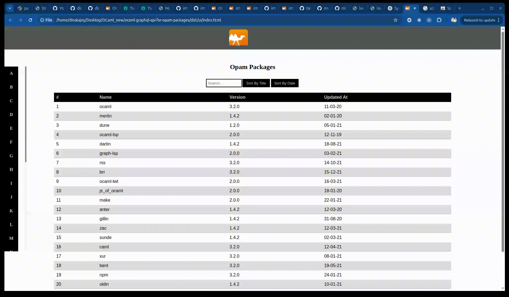

# simple_ocaml_graphql_api_server

A simple OCaml GraphQL API using `graphql-cohttp` that reads and returns json files of list of packages simulating Opam packages


## Setup your development environment
1. Get all dependencies:

```bash
make install
```

2. Build out the application:
      
```bash
make build
```
This will output the compiled files in `_build/`.

### Creating production builds

To create a production build of the application, you can run:

For Server ->
```bash
run-server:
```

For User Interface ->
Open another cli
```bash
run-client
```



### Repository Structure

The following snippet describes opam-packages repository structure.

```text
.
├── dist/
|   Static assets that you want to include when serving your application.
│   The content of this folder will get copied to the production build.
│
├── server/
|   Source code of the project application server.
│
├── client/
|   Source code of the project application user interface.
│
├── Makefile
│
├── package.json
│
└── README.md
